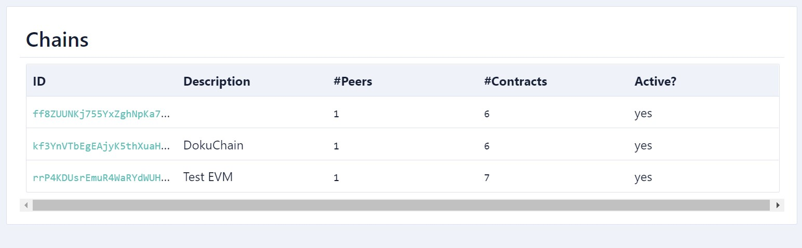

# Wasp-CLI Documentation

<details>
<summary>Table of Contents</summary>

* [Global Flags](#global-flags)
  * [address-index](#address-index)
  * [config string](#config-string)
  * [debug](#debug)
  * [verbose](#verbose)
  * [wait](#wait)
  * [help](#help)
* [Wasp-CLI Commands](#wasp-cli-commands)
  * [address](#address)
  * [balance](#balance)
  * [chain](#chain)
    * [activate](#activate)
    * [block](#block)
    * [call-view](#call-view)
    * [deactivate](#deactivate)
    * [deploy](#deploy)
      * [committee](#committee)
      * [description](#description)
      * [peers](#peers)
      * [quorum](#quorum)
    * [deploy-contract](#deploy-contract)
    * [deposit](#deposit)
    * [events](#events)
    * [info](#info)
    * [list](#list)
    * [list-accounts](#list-accounts)
    * [list-blobs](#list-blobs)
    * [list-contracts](#list-contracts)
    * [request](#request)
    * [post-request](#post-request)
    * [show-blob](#show-blob)
    * [store-blob](#store-blob)
  * [check-versions](#check-versions)
  * [decode](#decode)
  * [init](#init)
  * [metrics](#metrics)
  * [mint](#mint)
  * [peering](#peering)
  * [request-funds](#request-funds)
  * [send-funds](#send-funds)
  * [set](#set)

</details>

<!-- Global Flags  -->
## Global Flags
* #### address-index 
    Add an address-index to your command
    <details>
    <summary>Example</summary>

    ```bash

    ```

    </details>
    
* #### config-string
    Provide the path to your wasp-cli.json (default: **./wasp-cli.json**)
    <details>
    <summary>Example</summary>

    ```bash

    ```

    </details>

* #### debug
    Enable debug information
    <details>
    <summary>Example</summary>
    
    ```bash

    ```

    </details>

* #### verbose
    be verbose
    <details>
    <summary>Example</summary>
    
    ```bash

    ```

    </details>

* #### wait
    wait for request completion (default: **true**)
    <details>
    <summary>Example</summary>
    
    ```bash

    ```

    </details>

* #### help
    help for wasp-cli
    <details>
    <summary>Example</summary>
    
    ```bash
        ./wasp-cli -h
    ```

    </details>

## Wasp-CLI-Commands

* #### address
    
    <details>
    <summary>Example</summary>
    
    Command:

    ```bash
    ./wasp-cli address
    ```
    
    Response:

    ```bash
    Address index -i 1
    Address:     1BKQi3aa998nLP5be2KSi79GdcZSHN6v8mLFPQmDR2DbT  
    ```
    
    </details>

* #### balance
    
    <details>
    <summary>Example</summary>
    
    Command:

    ```bash
    ./wasp-cli balance -i 1
    ```

    Response:

    ```bash
    Address index 1
        Address: 1BKQi3aa998nLP5be2KSi79GdcZSHN6v8mLFPQmDR2DbT
        Balance:
        IOTA: 989898
        ---------------------------------------------------------
        Total: 989898
    ```

    </details>

* #### chain

    * #### activate
        
        <details>
        <summary>Example</summary>
    
        Command:

        ```bash
        ./wasp-cli chain activate --verbose
        ```

        Response:

        ```bash
        using Wasp host https://api.wasp.sc.iota.org
        ```

        </details>

    * #### block
        
        <details>
        <summary>Example</summary>
    
        Command:

        ```bash
        ./wasp-cli chain block
        ```

        Response:

        ```bash
        Block index: 235
        Timestamp: 2021-12-29T08:39:13Z
        Total requests: 1
        Successful requests: 1
        Off-ledger requests: 0
        Request 0 (5tKCDwpGkNcJzFMjkTqY4rJvfiX6TYaUCSVvSaMG5hgbV9)
            Kind: on-ledger
            Fee prepaid: no
            Sender: A/rrP4KDUsrEmuR4WaRYdWUH184ARTq9amaJBMV3vJHpbY::22e87e2d
            Contract Hname: 22e87e2d
            Entry point: b9c353a4
            Timestamp: 2021-12-29T08:39:10Z
            Arguments: (empty)
            Error: (empty)

        Total 0 events

        ```

        </details>

    * #### call-view

         <details>
        <summary>Example</summary>
    
        Command:

        ```bash
        
        ```

        Response:

        ```bash
        
        ```

        </details>

   * #### deactivate
        
        <details>
        <summary>Example</summary>
    
        Command:

        ```bash
        ./wasp-cli chain deactivate --verbose
        ```

        Response:

        ```bash
        using Wasp host https://api.wasp.sc.speccers-mana-fountain.org
        ```

        </details>

    * #### deploy

        * ##### committee
            
            <details>
            <summary>Example</summary>
    
            Command:

            ```bash
            ./wasp-cli chain deploy --committee=0,1,2,3 
            ```

            Response:

            ```bash
            creating new chain. Owner address: 1HxJxu91B5txjaCQZCrxKEYL2BBxditP9JXQ61z46eJRu. 
            State controller: UKkyiXTxSNxdr5aevmmcUDvBBfiFgCadYffETd84Bwct, N = 1, T = 3
            creating chain origin and init transaction 3Ld5XwiohBRCaRFXS6vGDJKtxpu2sJDNLoWSdpq6q5n6.. OK
            sending committee record to nodes.. OK
            activating chain ff8ZUUNKj755YxZghNpKa7KN3rGXUqUWdrssBJjHx8xP.. OK.
            chain has been created successfully on the Tangle. 
            ChainID: $/ff8ZUUNKj755YxZghNpKa7KN3rGXUqUWdrssBJjHx8xP, State address: UKkyiXTxSNxdr5aevmmcUDvBBfiFgCadYffETd84Bwct, N = 1, T = 3
            ```

            

            </details>

        * ##### description
            
            <details>
            <summary>Example</summary>
    
            Command:

            ```bash
            ./wasp-cli chain deploy --committee=0 --quorum=1 --description="DokuChain"
            ```

            Response:

            ```bash
            creating new chain. Owner address: 1HxJxu91B5txjaCQZCrxKEYL2BBxditP9JXQ61z46eJRu. 
            State controller: Zf3nfAKAZqjowZQ5rZhwNwX9AHF28vgBgiLFJPHjt1Xh, N = 1, T = 1
            creating chain origin and init transaction 7kGp7Fkdn5c4dehuaZChaKzeqgwQAmxGiDJFCQvtL7FV.. OK
            sending committee record to nodes.. OK
            activating chain kf3YnVTbEgEAjyK5thXuaH61AdZmDs6Qttn7gjzG9H4k.. OK.
            chain has been created successfully on the Tangle.
            ChainID: $/kf3YnVTbEgEAjyK5thXuaH61AdZmDs6Qttn7gjzG9H4k, State address: Zf3nfAKAZqjowZQ5rZhwNwX9AHF28vgBgiLFJPHjt1Xh, N = 1, T = 1

            ```

            

            </details>

        * ##### peers
            
            <details>
            <summary>Example</summary>
    
            Command:

            ```bash
        
            ```

            Response:

            ```bash
        
            ```

            </details>

        * ##### quorum
            
            <details>
            <summary>Example</summary>
    
            Command:

            ```bash
        
            ```

            Response:

            ```bash
        
            ```

            </details>

  * ##### deploy-contract
    
    <details>
    <summary>Example</summary>
    
    ```bash

    ```

    Response:

    ```bash
    
    ```

    </details>

  * ##### deposit
    
    <details>
    <summary>Example</summary>
    
    ```bash

    ```

    Response:

    ```bash
    
    ```

    </details>

  * ##### events
    
    <details>
    <summary>Example</summary>
    
     ```bash

    ```

    Response:

    ```bash
    
    ```

    </details>

  * ##### info
    
    <details>
    <summary>Example</summary>
    
    ```bash

    ```

    Response:

    ```bash
    
    ```

    </details>

  * ##### list
    
    <details>
    <summary>Example</summary>
    
    ```bash

    ```

    Response:

    ```bash
    
    ```

    </details>

  * ##### list-accounts
    
    <details>
    <summary>Example</summary>
    
    ```bash

    ```

    Response:

    ```bash
    
    ```

    </details>
  
  * ##### list-blobs
    
    <details>
    <summary>Example</summary>
    
    ```bash

    ```

    Response:

    ```bash
    
    ```

    </details>

  * ##### list-contracts
    
    <details>
    <summary>Example</summary>
    
    ```bash

    ```

    Response:

    ```bash
    
    ```

    </details>

  * ##### post-request
    
    <details>
    <summary>Example</summary>
    
    ```bash

    ```

    Response:

    ```bash
    
    ```

    </details>
  
  * ##### request
    
    <details>
    <summary>Example</summary>
    
    ```bash

    ```

    Response:

    ```bash
    
    ```

    </details>
  
  * ##### show-blob
    
    <details>
    <summary>Example</summary>
    
    ```bash

    ```

    Response:

    ```bash
    
    ```

    </details>

  * ##### store-blob
    
    <details>
    <summary>Example</summary>
    
    ```bash

    ```

    Response:

    ```bash
    
    ```

    </details>

* #### check-versions
    
    <details>
    <summary>Example</summary>
    
    Command:

    ```bash
    ./wasp-cli 
    ```
    
    Response:

    ```bash
  
    ```
    
    </details>

* #### decode
    
    <details>
    <summary>Example</summary>
    
    Command:

    ```bash
    ./wasp-cli 
    ```
    
    Response:

    ```bash
  
    ```
    
    </details>

* #### init
    
    <details>
    <summary>Example</summary>
    
    Command:

    ```bash
    ./wasp-cli 
    ```
    
    Response:

    ```bash
  
    ```
    
    </details>

* #### metrics
    
    <details>
    <summary>Example</summary>
    
    Command:

    ```bash
    ./wasp-cli 
    ```
    
    Response:

    ```bash
  
    ```
    
    </details>

* #### mint
    
    <details>
    <summary>Example</summary>
    
    Command:

    ```bash
    ./wasp-cli 
    ```
    
    Response:

    ```bash
  
    ```
    
    </details>

* #### peering
    
    <details>
    <summary>Example</summary>
    
    Command:

    ```bash
    ./wasp-cli 
    ```
    
    Response:

    ```bash
  
    ```
    
    </details>

* #### request-funds
    
    <details>
    <summary>Example</summary>
    
    Command:

    ```bash
    ./wasp-cli 
    ```
    
    Response:

    ```bash
  
    ```
    
    </details>

* #### send-funds
    
    <details>
    <summary>Example</summary>
    
    Command:

    ```bash
    ./wasp-cli 
    ```
    
    Response:

    ```bash
  
    ```
    
    </details>

* #### set
    
    <details>
    <summary>Example</summary>
    
    Command:

    ```bash
    ./wasp-cli 
    ```
    
    Response:

    ```bash
  
    ```
    
    </details>
